# AWS SSO Token Auto-Refresh - Architecture

**Last Updated:** 2026-02-15
**Version:** 1.0.0
**Status:** Production

---

## Table of Contents

1. [System Overview](#system-overview)
2. [Architecture Diagram](#architecture-diagram)
3. [Module Descriptions](#module-descriptions)
4. [Data Flow](#data-flow)
5. [Threading & Concurrency](#threading--concurrency)
6. [Error Handling & Recovery](#error-handling--recovery)
7. [Security Architecture](#security-architecture)
8. [Cache File Structure](#cache-file-structure)
9. [AWS OIDC Integration](#aws-oidc-integration)
10. [PM2 Integration](#pm2-integration)
11. [Performance Characteristics](#performance-characteristics)

---

## System Overview

The AWS SSO Token Auto-Refresh daemon is a long-running Node.js process that monitors AWS SSO token expiry and automatically refreshes access tokens before they expire. It operates as a PM2-managed daemon that:

1. Reads AWS CLI SSO cache files (`~/.aws/sso/cache/`)
2. Monitors token expiry timestamps
3. Refreshes tokens via AWS OIDC endpoint before expiry
4. Updates cache files atomically to maintain AWS CLI compatibility
5. Provides user notifications and comprehensive logging

### Design Goals

- **Zero manual intervention**: Tokens refresh automatically without user action
- **AWS CLI compatibility**: Works directly with AWS CLI cache structure
- **Reliability**: Atomic operations, retry logic, comprehensive error handling
- **Security**: No credential storage, secure file permissions, no token logging
- **Observability**: Rich logging, notifications, status monitoring

---

## Architecture Diagram

### High-Level System Architecture


### Module Interaction Diagram


---

## Module Descriptions

### index.js - Main Daemon Process

**Purpose:** Orchestrates the token monitoring loop and coordinates all system components.

**Responsibilities:**
- Validate configuration at startup
- Setup signal handlers for graceful shutdown (SIGINT, SIGTERM)
- Implement monitoring loop with configurable interval
- Coordinate token expiry checking and refresh operations
- Track consecutive failures and implement circuit breaker logic
- Handle uncaught exceptions and promise rejections

**Key Functions:**
- `main()` - Entry point, initializes daemon
- `startMonitoring()` - Starts periodic token checks
- `stopMonitoring()` - Gracefully stops daemon
- `refreshTokenIfNeeded()` - Core refresh logic
- `setupShutdownHandlers()` - Registers signal handlers

**Global State:**
- `monitorInterval` - setInterval timer for periodic checks
- `isShuttingDown` - Shutdown flag to prevent new operations
- `consecutiveFailures` - Counter for failure tracking

---

### config.js - Configuration Management

**Purpose:** Centralized configuration loading, validation, and access.

**Responsibilities:**
- Load environment variables from .env file
- Apply sensible defaults for optional settings
- Validate required configuration (AWS profile, session, region)
- Validate input format to prevent injection attacks
- Provide configuration summary for logging
- Generate AWS OIDC endpoint URLs

**Key Features:**
- **Security validation:** Profile/session names validated with regex to prevent shell injection
- **Type conversion:** Converts string env vars to appropriate types (boolean, int, milliseconds)
- **Constants management:** Application-wide constants (timeouts, thresholds, etc.)

**Security:**
- Profile names: `^[a-zA-Z0-9_-]+$` (prevents shell metacharacters)
- Session names: `^[a-zA-Z0-9_-]+$` (prevents injection)
- Length limits: 128 characters maximum

---

### cache-manager.js - AWS Cache Integration

**Purpose:** Interface with AWS CLI's SSO cache files for reading and writing tokens.

**Responsibilities:**
- Parse AWS config file (`~/.aws/config`) to locate SSO settings
- Compute cache filename (SHA1 of SSO start URL)
- Read token cache with validation
- Write tokens atomically to prevent corruption
- Calculate token expiry and time remaining
- Provide token status information

**Key Features:**
- **Config caching:** Caches parsed AWS config with mtime-based invalidation
- **Fallback search:** If computed cache path doesn't exist, searches directory for matching startUrl
- **Atomic writes:** Uses write-file-atomic for safe concurrent access
- **File permissions:** Sets cache files to 0600 (owner read/write only)

**Cache File Lookup:**
```javascript
// 1. Parse ~/.aws/config to get SSO start URL
startUrl = config['sso-session name'].sso_start_url

// 2. Compute cache filename
filename = sha1(startUrl) + '.json'

// 3. Full path
cachePath = ~/.aws/sso/cache/{filename}
```

---

### token-refresher.js - OIDC Token Refresh

**Purpose:** Communicate with AWS OIDC endpoint to refresh access tokens.

**Responsibilities:**
- POST refresh token grant requests to AWS OIDC endpoint
- Validate OIDC response structure
- Implement retry logic with linear backoff
- Distinguish retryable vs non-retryable errors
- Cancel in-flight requests during shutdown
- Rate limit requests to prevent endpoint hammering

**Error Classification:**
- **Non-retryable:** `invalid_grant`, `invalid credentials`, `401 Unauthorized`
- **Retryable:** Network timeouts, connection refused, 5xx errors

**Retry Strategy:**
- Linear backoff: `attempt * RETRY_BACKOFF_SECONDS`
- Example (MAX_RETRY_ATTEMPTS=3, RETRY_BACKOFF_SECONDS=10):
  - Attempt 1: Immediate
  - Attempt 2: Wait 10s
  - Attempt 3: Wait 20s

**Rate Limiting:**
- Minimum 5 seconds between requests
- Prevents daemon error loops from hammering AWS endpoint

---

### logger.js - Logging Infrastructure

**Purpose:** Structured logging with rotation and multiple output formats.

**Responsibilities:**
- Winston-based logging with custom log methods
- Daily log rotation with size and count limits
- Console output for PM2 (human-readable)
- File output for analysis (structured JSON)
- Exception and rejection handling

**Transports:**
1. **File Transport (DailyRotateFile)**
   - Format: Structured JSON with timestamps
   - Rotation: Daily + size-based (10MB default)
   - Retention: 5 files default
   - Location: `./logs/refresh-YYYY-MM-DD.log`

2. **Console Transport**
   - Format: Human-readable with colors
   - Level: Configurable (debug/info/warn/error)
   - Output: Captured by PM2

**Custom Log Methods:**
- `logger.startup()` - Application startup events (🚀)
- `logger.success()` - Successful operations (✅)
- `logger.failure()` - Failed operations (❌)
- `logger.refresh()` - Token refresh operations (🔄)
- `logger.token()` - Token metadata (never logs actual tokens) (🔑)

---

### notifier.js - macOS Notification System

**Purpose:** Send native macOS notifications for important daemon events.

**Responsibilities:**
- Send notifications via macOS Notification Center
- Filter notifications based on configuration
- Provide event-specific notification formats
- Auto-dismiss after timeout

**Notification Types:**
- **Success:** Token refreshed (optional, `NOTIFY_ON_SUCCESS`)
- **Error:** Refresh failed or re-login required
- **Warning:** Token expiring soon
- **Info:** Daemon startup/shutdown

**Configuration:**
- `NOTIFY_ON_SUCCESS` - Show success notifications (default: false)
- `NOTIFY_ON_ERROR` - Show error notifications (default: true)
- `NOTIFY_ON_STARTUP` - Show startup notification (default: true)
- `NOTIFY_SOUND` - Sound name (default: 'default', errors use 'Basso')

---

## Data Flow

### Startup Sequence

```mermaid
sequenceDiagram
    participant User
    participant Script as start.sh
    participant PM2
    participant Daemon as index.js
    participant Config
    participant CacheMgr
    participant Logger

    User->>Script: ./scripts/start.sh
    Script->>PM2: pm2 start ecosystem.config.js
    PM2->>Daemon: spawn process

    Daemon->>Config: validateConfig()

    alt Config invalid
        Config-->>Daemon: throw Error
        Daemon->>Logger: failure()
        Daemon->>User: exit(1)
    else Config valid
        Config-->>Daemon: ✓ Valid
        Daemon->>Daemon: setupShutdownHandlers()
        Daemon->>Logger: startup()
        Daemon->>CacheMgr: readTokenCache()

        alt Token needs refresh
            CacheMgr-->>Daemon: true
            Daemon->>Daemon: refreshTokenIfNeeded()
        else Token valid
            CacheMgr-->>Daemon: false
            Daemon->>Logger: debug()
        end

        Daemon->>Daemon: setInterval(refreshTokenIfNeeded, 60s)
        Daemon->>User: ✓ Running
    end
```



### Token Refresh Flow


### Graceful Shutdown Flow

```mermaid
sequenceDiagram
    participant Signal as SIGINT/SIGTERM
    participant Main as index.js
    participant TokenRef as token-refresher.js
    participant Notifier
    participant Logger

    Signal->>Main: Shutdown signal
    Main->>Logger: info("Received signal")
    Main->>Main: stopMonitoring()

    Main->>Main: set isShuttingDown = true
    Main->>Main: clearInterval(monitorInterval)
    Main->>Logger: info("Interval stopped")

    Main->>TokenRef: cleanup()
    TokenRef->>TokenRef: abort in-flight HTTP request
    TokenRef-->>Main: ✓ Cleaned up

    Main->>Notifier: notifyShutdown()
    Main->>Logger: info("Daemon stopped")

    Main->>Main: setTimeout(1000ms)
    Note over Main: Wait for cleanup

    Main->>Main: process.exit(0)
```



---

## Threading & Concurrency

### Process Model

**Single-threaded Node.js event loop:**
- Main thread handles all operations
- Asynchronous I/O for file operations and HTTP requests
- No worker threads or child processes

**Concurrency Mechanisms:**
- `setInterval()` for periodic token checks (every 60s default)
- `async/await` for sequential async operations
- AbortController for request cancellation during shutdown

### Potential Race Conditions & Mitigations

| Race Condition | Mitigation |
|----------------|------------|
| Concurrent cache writes | Atomic writes via write-file-atomic package |
| Overlapping refresh attempts | Single-threaded event loop prevents parallelism |
| Shutdown during refresh | isShuttingDown flag + AbortController |
| Multiple daemon instances | PM2_APP_NAME uniqueness + PM2 management |
| AWS CLI concurrent writes | Atomic writes + read-merge-write pattern |

### File Access Patterns

**Cache file operations:**
1. **Read:** Non-blocking async read via fsPromises
2. **Write:** Atomic write sequence:
   - Write to temporary file with secure permissions (0600)
   - Atomically rename temp file to target (atomic at filesystem level)
   - Explicit chmod to ensure permissions

**Config file operations:**
- Read-only access to `~/.aws/config`
- Cached with mtime-based invalidation
- Re-parsed only when file modified

---

## Error Handling & Recovery

### Error Taxonomy

#### Configuration Errors (Fatal)
**When:** Startup only
**Action:** Log error, notify user, exit(1)
**Examples:**
- Missing AWS_SSO_PROFILE or AWS_SSO_SESSION
- Invalid profile/session name format
- Missing AWS config file

#### Cache Errors (Retryable)
**When:** During operation
**Action:** Log error, notify user, continue monitoring
**Examples:**
- Cache file not found → User needs to run `aws sso login`
- Cache file missing fields → Re-login required
- Invalid date format → Re-login required

#### Network Errors (Retryable)
**When:** During OIDC API call
**Action:** Retry with backoff, log attempts, continue monitoring
**Examples:**
- Connection timeout (ETIMEDOUT)
- Connection refused (ECONNREFUSED)
- DNS failure (ENOTFOUND)
- HTTP 5xx errors

#### Authentication Errors (Non-retryable)
**When:** During OIDC API call
**Action:** Notify user to re-login, log error, continue monitoring
**Examples:**
- invalid_grant (refresh token expired)
- 401 Unauthorized (credentials invalid)

### Retry Strategy

**Parameters:**
- `MAX_RETRY_ATTEMPTS` - Maximum retry attempts (default: 3)
- `RETRY_BACKOFF_SECONDS` - Base backoff delay (default: 10)
- Backoff calculation: `attempt * RETRY_BACKOFF_SECONDS` (linear)

**Retry Decision Matrix:**

| Error Type | Retry? | Max Attempts | Backoff |
|------------|--------|--------------|---------|
| Network timeout | ✓ Yes | 3 | Linear (10s, 20s) |
| Connection refused | ✓ Yes | 3 | Linear (10s, 20s) |
| HTTP 5xx | ✓ Yes | 3 | Linear (10s, 20s) |
| invalid_grant | ✗ No | 0 | N/A |
| 401 Unauthorized | ✗ No | 0 | N/A |
| Shutdown signal | ✗ No | 0 | N/A |

### Failure Tracking

**Consecutive Failure Counter:**
- Incremented on each refresh failure
- Reset to 0 on successful refresh or valid token check
- Warning logged at `MAX_CONSECUTIVE_FAILURES` (default: 5)
- Daemon continues monitoring even after max failures

**Purpose:**
- Detect persistent configuration or network issues
- Alert user to systemic problems
- Prevent indefinite silent failures

### Circuit Breaker (Implicit)

The daemon implements an implicit circuit breaker through:
- Rate limiting: Minimum 5s between OIDC requests
- Failure counter: Warns after 5 consecutive failures
- Configuration: User can increase `REFRESH_CHECK_INTERVAL` to reduce frequency

---

## Security Architecture

### Threat Model

**Assets to Protect:**
1. AWS access tokens (short-lived, 1 hour)
2. AWS refresh tokens (long-lived, 90 days)
3. OIDC client credentials (clientId, clientSecret)

**Threat Vectors:**
1. Unauthorized file access (other users reading cache)
2. Token exposure in logs/errors
3. Network MITM attacks on OIDC endpoint
4. Shell injection via profile/session names

### Security Controls

#### File Permissions

**Cache files (`~/.aws/sso/cache/*.json`):**
- Mode: `0600` (owner read/write only)
- Set on every write operation (defense in depth)
- Prevents other users from reading tokens

**Log files (`./logs/*.log`):**
- Mode: Default process umask (typically 0644)
- Contains no sensitive data (tokens never logged)
- Metadata only (timestamps, booleans, error messages)

#### Token Logging Policy

**NEVER logged:**
- `accessToken` - Actual access token value
- `refreshToken` - Actual refresh token value
- `clientSecret` - OIDC client secret
- Any other credential values

**Safe to log:**
- `expiresAt` - Timestamp when token expires
- `expiresIn` - Seconds until expiry
- `hasAccessToken` - Boolean flag (true/false)
- `hasRefreshToken` - Boolean flag (true/false)

**Implementation:**
```javascript
// ✅ SAFE
logger.token('Token read', {
  expiresAt: cache.expiresAt,
  hasAccessToken: !!cache.accessToken
});

// ❌ NEVER DO THIS
logger.debug('Token:', cache.accessToken); // SECURITY VIOLATION
```

#### Input Validation

**Profile name validation:**
```javascript
// Regex: ^[a-zA-Z0-9_-]+$
// Allows: Letters, numbers, hyphens, underscores
// Blocks: ; | & $ ` \ " ' < > ( ) { } [ ] spaces etc.

if (!/^[a-zA-Z0-9_-]+$/.test(profileName)) {
  throw new Error('Invalid profile name format');
}
```

**Purpose:**
- Prevent shell injection in error messages
- Prevent path traversal attacks
- Prevent config file parsing exploits

#### Network Security

**OIDC endpoint:**
- HTTPS only (TLS 1.2+)
- Validates SSL certificates
- 30-second timeout prevents hanging
- AbortController enables request cancellation

**MITM Protection:**
- Node.js built-in certificate validation
- No certificate pinning (follows AWS certificate rotation)
- Uses system certificate store

#### API Response Sanitization

All API error responses are sanitized before logging:
```javascript
function sanitizeApiResponse(data) {
  const sensitiveFields = [
    'accessToken', 'access_token',
    'refreshToken', 'refresh_token',
    'clientSecret', 'client_secret',
    'secret', 'password', 'apiKey'
  ];

  sensitiveFields.forEach(field => {
    if (field in data) data[field] = '[REDACTED]';
  });
}
```

---

## Cache File Structure

### AWS CLI Cache Format

AWS CLI stores SSO tokens in JSON files at `~/.aws/sso/cache/{sha1}.json`

**Filename Computation:**
```javascript
startUrl = config['sso-session mysession'].sso_start_url
filename = sha1(startUrl) + '.json'
// Example: a1b2c3d4e5f6789012345678901234567890abcd.json
```

### Cache File Schema

```json
{
  "accessToken": "eyJraWQiOiJ...", // JWT access token (string)
  "expiresAt": "2026-01-24T14:30:00Z", // ISO 8601 timestamp (string)
  "refreshToken": "Atzr|IwEBIA...", // Refresh token (string)
  "clientId": "abc123def456", // OIDC client ID (string)
  "clientSecret": "xyz789uvw012", // OIDC client secret (string)
  "registrationExpiresAt": "2026-04-24T14:30:00Z", // Client registration expiry
  "region": "ca-central-1", // AWS region (string)
  "startUrl": "https://cix-sso.awsapps.com/start/#" // SSO start URL (string)
}
```

**Field Descriptions:**

| Field | Required | Description |
|-------|----------|-------------|
| `accessToken` | ✓ Yes | Short-lived access token (1 hour), used by AWS CLI for API calls |
| `expiresAt` | ✓ Yes | When accessToken expires (ISO 8601 UTC timestamp) |
| `refreshToken` | ✓ Yes | Long-lived token (90 days), used to get new access tokens |
| `clientId` | ✓ Yes | OIDC client identifier for this SSO session |
| `clientSecret` | ✓ Yes | OIDC client secret for authentication |
| `registrationExpiresAt` | No | When OIDC client registration expires |
| `region` | No | AWS region for OIDC endpoint |
| `startUrl` | No | SSO portal URL (used to compute cache filename) |

### Cache Update Strategy

**Read-Merge-Write Pattern:**
1. Read current cache file completely
2. Merge new tokens while preserving other fields
3. Write merged result atomically

```javascript
// Read current cache
const current = JSON.parse(fs.readFileSync(cachePath));

// Merge new tokens (preserve clientId, clientSecret, etc.)
const updated = {
  ...current,
  accessToken: newTokens.accessToken,
  expiresAt: newTokens.expiresAt,
  ...(newTokens.refreshToken && { refreshToken: newTokens.refreshToken })
};

// Atomic write with secure permissions
await writeFileAtomic(cachePath, JSON.stringify(updated, null, 2), { mode: 0o600 });
```

**Why preserve existing fields?**
- `clientId` and `clientSecret` don't change during refresh
- `startUrl` is needed for next daemon restart
- `region` is metadata AWS CLI may use
- Minimizes cache format changes

---

## AWS OIDC Integration

### OIDC Token Endpoint

**URL Format:**
```
https://oidc.{region}.amazonaws.com/token
```

**Example:**
```
https://oidc.ca-central-1.amazonaws.com/token
```

**Region Configuration:**
- Default: `ca-central-1` (configurable via `AWS_REGION`)
- Can be overridden with explicit `OIDC_ENDPOINT`

### Token Refresh Request

**HTTP Method:** POST
**Content-Type:** application/json

**Request Body:**
```json
{
  "clientId": "abc123def456",
  "clientSecret": "xyz789uvw012",
  "grantType": "refresh_token",
  "refreshToken": "Atzr|IwEBIA..."
}
```

**Field Descriptions:**
- `clientId` - OIDC client identifier from cache
- `clientSecret` - OIDC client secret from cache
- `grantType` - Must be "refresh_token" (OAuth 2.0 grant type)
- `refreshToken` - Current refresh token from cache

### Token Refresh Response

**Success (200 OK):**
```json
{
  "accessToken": "eyJraWQiOiJ...",
  "expiresIn": 3600,
  "refreshToken": "Atzr|IwEBIB..." // Optional, only if rotated
}
```

**Response Fields:**
- `accessToken` - New JWT access token (required)
- `expiresIn` - Seconds until expiry (required, typically 3600 = 1 hour)
- `refreshToken` - New refresh token (optional, only if AWS rotates it)

**Expiry Calculation:**
```javascript
const expiryTime = Date.now() + (expiresIn * 1000);
const expiresAt = new Date(expiryTime).toISOString();
// Example: "2026-01-24T14:30:00.000Z"
```

### Error Responses

**400 Bad Request - Invalid Grant:**
```json
{
  "error": "invalid_grant",
  "error_description": "Refresh token expired or invalid"
}
```
**Action:** Notify user to re-login, don't retry

**401 Unauthorized - Invalid Credentials:**
```json
{
  "error": "invalid_client",
  "error_description": "Client authentication failed"
}
```
**Action:** Notify user to re-login, don't retry

**5xx Server Error:**
```json
{
  "error": "server_error",
  "error_description": "Internal server error"
}
```
**Action:** Retry with backoff (transient error)

### Request Configuration

**Timeout:** 30 seconds (`OIDC_REQUEST_TIMEOUT_MS`)
**TLS:** HTTPS with certificate validation
**Retries:** Up to 3 attempts with linear backoff
**Rate Limit:** Minimum 5 seconds between requests
**Cancellation:** AbortController for graceful shutdown

---

## PM2 Integration

### PM2 Configuration

**File:** `ecosystem.config.js`

```javascript
module.exports = {
  apps: [{
    name: process.env.PM2_APP_NAME || 'aws-sso-refresh',
    script: 'src/index.js',
    instances: 1,
    autorestart: true,
    watch: false,
    max_memory_restart: '200M',
    env: {
      NODE_ENV: 'production'
    }
  }]
};
```

**Key Settings:**
- `instances: 1` - Single instance (daemon is not horizontally scalable)
- `autorestart: true` - Auto-restart on crashes
- `watch: false` - Don't restart on file changes (production mode)
- `max_memory_restart` - Restart if memory exceeds 200MB (safety limit)

### PM2 Process Lifecycle


### Signal Handling

**Graceful Stop (pm2 stop):**
1. PM2 sends SIGINT to process
2. Daemon receives signal in setupShutdownHandlers()
3. stopMonitoring() clears interval and cancels requests
4. Daemon waits 1 second for cleanup
5. process.exit(0)
6. PM2 marks process as stopped

**Forced Kill (pm2 kill):**
1. PM2 sends SIGTERM
2. If process doesn't exit within timeout, PM2 sends SIGKILL
3. Process terminates immediately (no cleanup)

**Graceful Restart (pm2 restart):**
1. PM2 starts new process instance
2. Once new instance is online, PM2 stops old instance
3. Zero-downtime restart

### PM2 Logging Integration

**PM2 Log Files:**
- `~/.pm2/logs/aws-sso-refresh-out.log` - stdout (console transport)
- `~/.pm2/logs/aws-sso-refresh-error.log` - stderr (uncaught errors)

**Application Log Files:**
- `./logs/refresh-YYYY-MM-DD.log` - Daily rotated application logs
- `./logs/exceptions.log` - Uncaught exceptions
- `./logs/rejections.log` - Unhandled promise rejections

**Log Flow:**
```
Winston Logger
  ├─> Console Transport → PM2 captures → ~/.pm2/logs/
  └─> File Transport → ./logs/refresh-YYYY-MM-DD.log
```

### PM2 Commands

| Command | Description |
|---------|-------------|
| `pm2 start ecosystem.config.js` | Start daemon |
| `pm2 stop aws-sso-refresh` | Graceful stop |
| `pm2 restart aws-sso-refresh` | Graceful restart |
| `pm2 delete aws-sso-refresh` | Remove from PM2 |
| `pm2 logs aws-sso-refresh` | View live logs |
| `pm2 describe aws-sso-refresh` | Show process details |
| `pm2 monit` | Real-time monitoring |
| `pm2 save` | Save process list |
| `pm2 startup` | Configure auto-start on boot |

---

## Performance Characteristics

### Resource Usage

**Baseline (Idle):**
- Memory: 40-50 MB RSS
- CPU: <1% (only active during checks)
- Disk: ~5 MB (application code)
- Network: Negligible

**During Token Refresh:**
- Memory: +5-10 MB (HTTP request buffers)
- CPU: 2-5% (JSON parsing, crypto operations)
- Disk I/O: <1 KB/s (cache file writes)
- Network: ~5 KB per request

### Timing Characteristics

**Token Refresh Operation:**
| Phase | Duration |
|-------|----------|
| Cache read | <1 ms |
| OIDC API call | 100-500 ms |
| Cache write (atomic) | <5 ms |
| Total | ~150-600 ms |

**Startup Time:**
| Phase | Duration |
|-------|----------|
| Config validation | <10 ms |
| Initial token check | 150-600 ms |
| Ready | <1 second |

### Scalability Limits

**Single Profile Limitations:**
- One daemon instance per AWS profile
- Not horizontally scalable (stateful monitoring loop)
- No coordination between instances

**Multi-Profile Strategy:**
- Run separate daemon instance for each profile
- Each instance has unique PM2_APP_NAME
- Instances operate independently
- Linear scaling: N profiles = N daemon instances

**System Limits:**
- Max profiles per machine: Limited by PM2/system resources
- Memory per instance: ~50 MB
- Practical limit: ~50 profiles (2.5 GB total memory)

### Optimization Opportunities

**Current Implementation (Optimized for Reliability):**
- Synchronous retry logic (linear backoff)
- Single-threaded event loop
- Full cache file read on every check

**Potential Optimizations (Not Implemented):**
- Batch refresh for multiple profiles (requires multi-profile coordination)
- Exponential backoff (current: linear)
- Cache file mtime-based skip (avoid reading if not modified)
- HTTP connection pooling (keep-alive)

**Trade-offs:**
- Reliability > Performance (daemon is not performance-critical)
- Simplicity > Optimization (easier to debug and maintain)
- Safety > Speed (atomic operations prevent corruption)

---

## Appendix

### Related Documentation

- **README.md** - User guide, installation, configuration
- **CONTRIBUTING.md** - Development setup, coding standards (TODO)
- **CHANGELOG.md** - Version history (TODO)

### External References

- [AWS SSO OIDC API Documentation](https://docs.aws.amazon.com/singlesignon/latest/OIDCAPIReference/Welcome.html)
- [AWS CLI SSO Configuration](https://docs.aws.amazon.com/cli/latest/userguide/cli-configure-sso.html)
- [OAuth 2.0 Refresh Token Grant](https://datatracker.ietf.org/doc/html/rfc6749#section-6)
- [Winston Logger Documentation](https://github.com/winstonjs/winston)
- [PM2 Process Manager](https://pm2.keymetrics.io/docs/usage/quick-start/)

### Glossary

| Term | Definition |
|------|------------|
| **Access Token** | Short-lived JWT token (1 hour) used by AWS CLI for API calls |
| **Refresh Token** | Long-lived token (90 days) used to obtain new access tokens |
| **OIDC** | OpenID Connect, authentication protocol used by AWS SSO |
| **PM2** | Process manager for Node.js applications |
| **Cache File** | JSON file storing AWS SSO tokens at `~/.aws/sso/cache/` |
| **SSO Session** | Named configuration in `~/.aws/config` defining SSO settings |
| **Atomic Write** | Write operation that completes entirely or not at all (no partial writes) |
| **Graceful Shutdown** | Clean process termination with resource cleanup |

---

**Document Version:** 1.0.0
**Last Updated:** 2026-02-15
**Maintained By:** AWS Auto-Refresh Project
